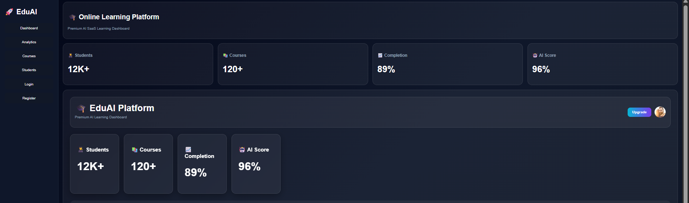
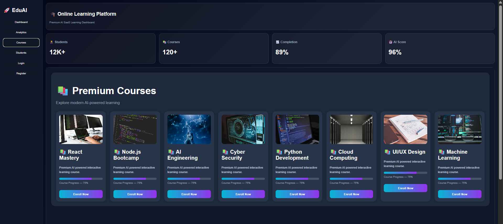
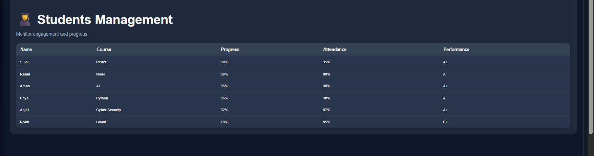
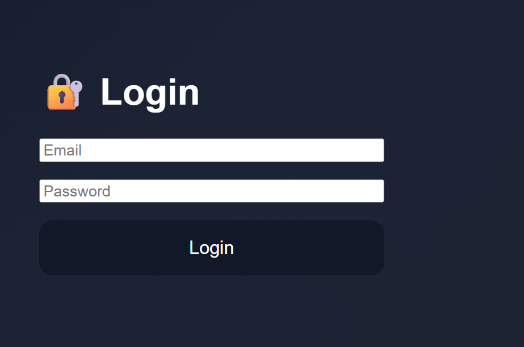
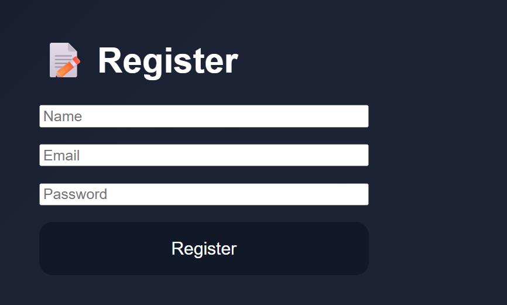
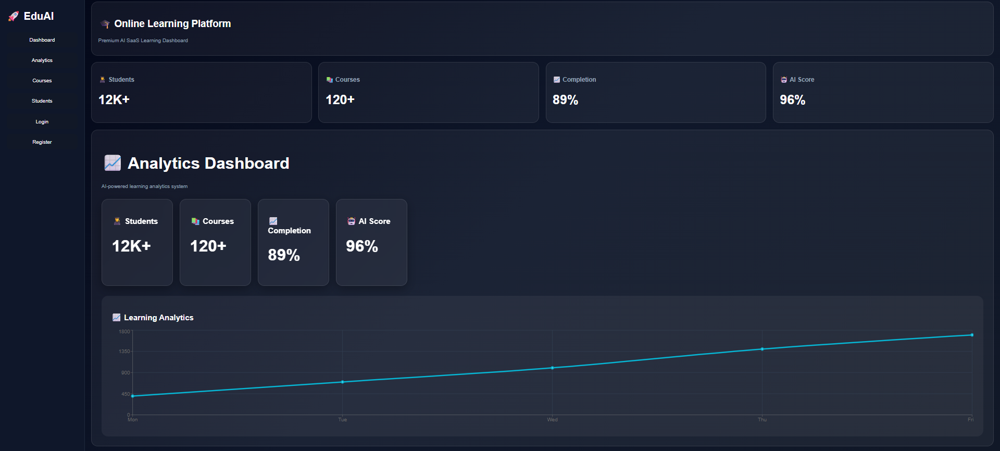
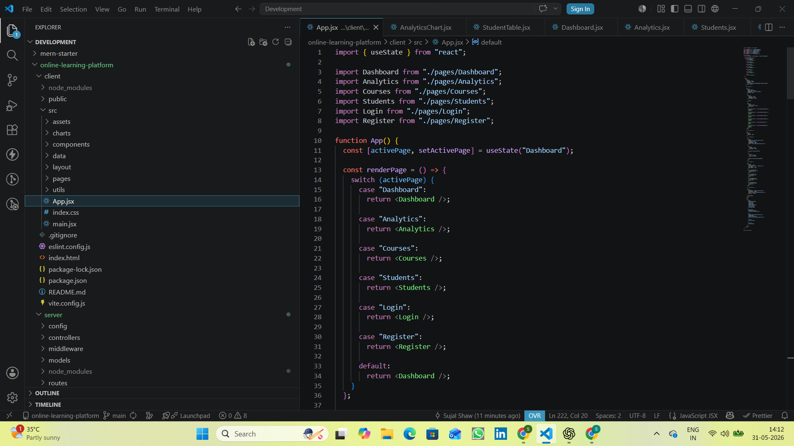

<div align="center">

# 🚀 EduAI — Premium Online Learning Platform

### AI-Powered MERN Learning Management System

Modern SaaS-inspired full-stack learning platform engineered with scalable MERN architecture, analytics dashboards, authentication workflows, responsive UI systems, and production-oriented engineering practices.

---


---

</div>

---

# 📖 Project Overview

EduAI is a premium AI-powered online learning platform developed using the MERN stack architecture with a production-oriented SaaS UI approach.

The platform focuses on scalable frontend-backend workflows, responsive dashboard systems, authentication architecture, analytics visualization, reusable component engineering, and modern learning management experiences.

This project was built to understand how real-world SaaS learning systems operate by integrating:

- scalable React frontend architecture
- modular backend API structure
- analytics dashboards
- reusable UI systems
- responsive design engineering
- authentication workflows
- modern deployment architecture
- scalable component-driven development

The goal of the project was not only building CRUD functionality, but learning how complete production-style systems are engineered and managed.

---

# ✨ Core Features

## 🎯 Dashboard Features

- Premium SaaS dashboard UI
- KPI analytics cards
- AI performance metrics
- Student activity monitoring
- Completion rate tracking
- Responsive dashboard system

---

## 📚 Course Management

- Dynamic course cards
- AI-powered course recommendations
- Course progress tracking
- Enrollment UI system
- Premium learning modules

---

## 👨‍🎓 Student Management

- Student analytics table
- Attendance tracking
- Engagement monitoring
- Performance analysis
- Learning progress system

---

## 🔐 Authentication System

- JWT Authentication workflow
- Login/Register architecture
- Protected routes
- Secure API communication
- Authentication middleware design

---

## 📈 Analytics & Insights

- Dashboard analytics
- Completion metrics
- Learning insights
- Realtime dashboard structure
- Chart visualization system

---

## ⚡ SaaS UI Engineering

- Responsive layouts
- Modern dark UI
- Framer Motion animations
- Scalable component system
- Modular frontend structure

---

# 🖼️ Application Preview

## 🚀 Dashboard



---

## 📚 Courses Module



---

## 👨‍🎓 Student Management



---

## 🔐 Login System



---

## 📝 Register System



---

## 🎨 UI Showcase



---

## 🏗️ Project Structure



---

# 🏗️ Workflow Architecture

```txt
Client (React + Vite)
        ↓
Frontend Components
        ↓
React Router
        ↓
Express API Layer
        ↓
Authentication Middleware
        ↓
MongoDB Database
```

---

# ⚡ Realtime System Workflow

```txt
User Interaction
        ↓
Socket.IO Events
        ↓
Realtime Dashboard Updates
        ↓
Analytics Rendering
```

---

# ⚙️ Tech Stack

| Category | Technologies |
|---|---|
| Frontend | React.js, Vite |
| Backend | Node.js, Express.js |
| Database | MongoDB |
| Authentication | JWT |
| Realtime | Socket.IO |
| Styling | Tailwind CSS |
| Charts | Recharts |
| Animation | Framer Motion |
| Deployment | Vercel, Render |
| Version Control | Git & GitHub |

---

# 📂 Project Structure

```bash
EduAI/
│
├── client/
│   ├── src/
│   │   ├── components/
│   │   ├── pages/
│   │   ├── charts/
│   │   ├── data/
│   │   ├── layout/
│   │   └── utils/
│
├── server/
│   ├── routes/
│   ├── controllers/
│   ├── middleware/
│   ├── models/
│   └── config/
│
├── images/
├── public/
├── README.md
└── package.json
```

---

# 🔄 System Workflow

## 🔐 Authentication Flow

```txt
User Login/Register
        ↓
Frontend Validation
        ↓
API Request
        ↓
JWT Token Generation
        ↓
Protected Dashboard Access
```

---

## 📚 Course Workflow

```txt
Courses → Enrollment → Progress Tracking → Analytics Dashboard
```

---

## 📊 Analytics Workflow

```txt
Student Data
      ↓
Analytics Engine
      ↓
Charts & KPIs
      ↓
Dashboard Visualization
```

---

# 🔐 Environment Variables

Create `.env` inside server folder:

```env
PORT=5000
MONGO_URI=your_mongodb_uri
JWT_SECRET=your_secret_key
CLIENT_URL=http://localhost:5173
```

| Variable | Description |
|---|---|
| PORT | Backend server port |
| MONGO_URI | MongoDB connection string |
| JWT_SECRET | Authentication secret |
| CLIENT_URL | Frontend URL |

---

# 🚀 Installation & Setup

## 1️⃣ Clone Repository

```bash
git clone https://github.com/yourusername/EduAI.git
```

---

## 2️⃣ Install Frontend Dependencies

```bash
cd client
npm install
```

---

## 3️⃣ Install Backend Dependencies

```bash
cd ../server
npm install
```

---

## 4️⃣ Run Frontend

```bash
cd client
npm run dev
```

---

## 5️⃣ Run Backend

```bash
cd server
npm run server
```

---

# 📊 Engineering Highlights

- Modular React architecture
- Reusable UI components
- Scalable frontend structure
- Authentication middleware design
- API separation architecture
- Realtime workflow integration
- Responsive SaaS engineering
- Dashboard analytics rendering
- Production-oriented folder structure
- Scalable MERN workflows

---

# 🧪 Future Improvements

- AI recommendation engine
- Docker containerization
- Kubernetes orchestration
- Advanced analytics dashboard
- Payment integration
- Course certification system
- Redis caching layer
- CI/CD pipelines
- Observability & monitoring
- Role-based access control

---

# 📚 Learning Outcomes

This project significantly improved my understanding of:

- scalable MERN architecture
- frontend-backend integration
- authentication systems
- API communication
- reusable React component systems
- responsive SaaS engineering
- analytics dashboard architecture
- realtime system workflows
- Git & GitHub workflows
- deployment pipelines
- debugging production-level issues

---

# 👨‍💻 Author

## Sujal Kumar Shaw

ECE Student • MERN Stack Developer • Full Stack Engineer

### 🌐 Connect With Me

- GitHub: https://github.com/yourusername
- LinkedIn: https://linkedin.com/in/yourprofile
- Portfolio: https://yourportfolio.com

---

# 🌟 Support

If you found this project useful:

⭐ Star the repository  
🍴 Fork the project  
🐛 Open issues  
🚀 Contribute improvements  


---

# 🏁 Final Note

Engineered with scalability, performance, modular architecture, and modern full-stack engineering practices in mind.

🔥 Built with modern technologies and scalable architecture 🔥
